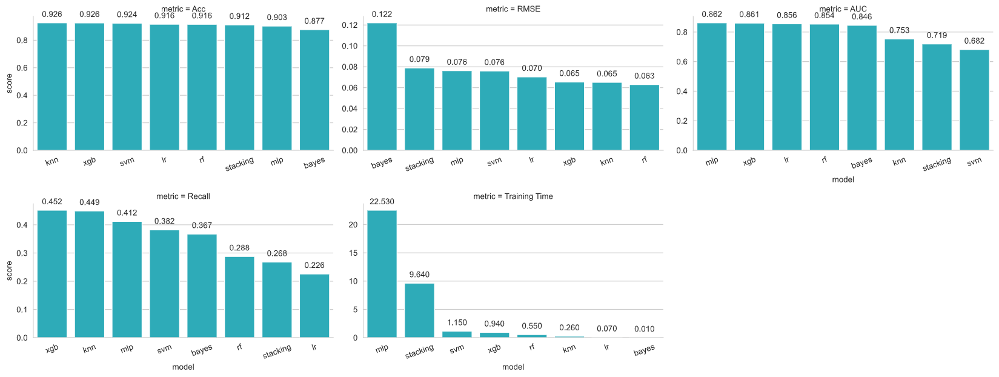
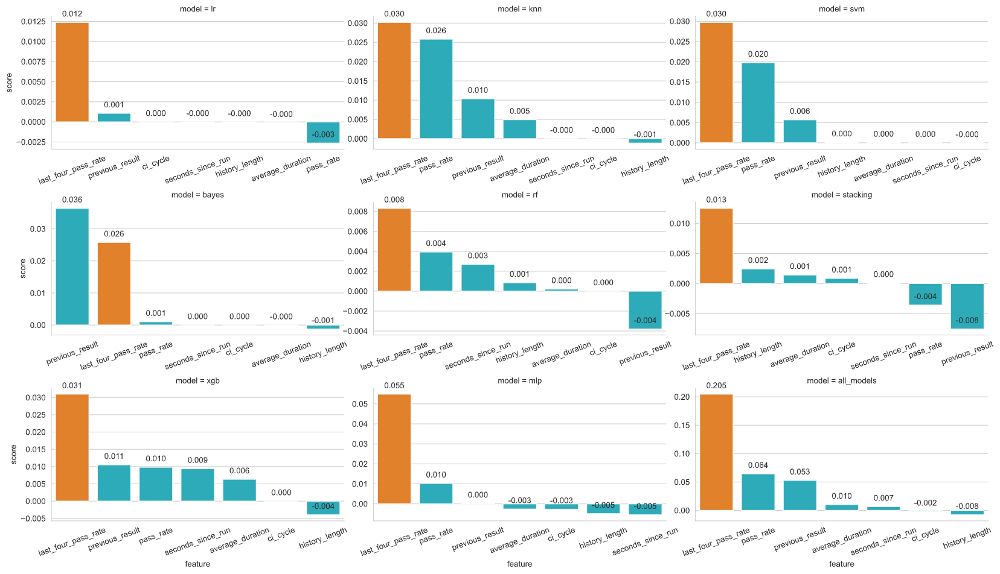

# Tabular-ML-First-Pass

This project contains a notebook that is useful as a first pass for any tabular binary classification or regression problem. It compares a number of ML models and does a feature analysis to provide insight into most impactful features within data-set.

### Models Compared
- Logistic Regression
- K Nearest Neighbor
- Support Vector Machine
- Gaussian Naive Bayes
- Random Forrest Classifier
- Stacking Classifier (all above)
- XGBoost
- MLP Classifier

### Metrics Used
- Root Mean Squared Error
- Area Under Curve
- Accuracy
- Recall
- Training Time

#### Example Model Comparison

### Feature Analysis

## License
[MIT](https://choosealicense.com/licenses/mit/)